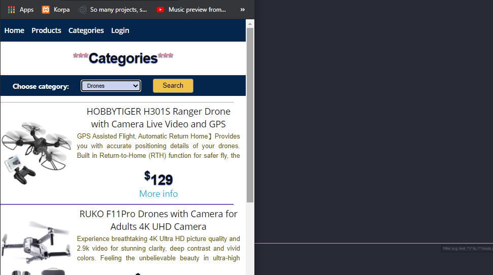
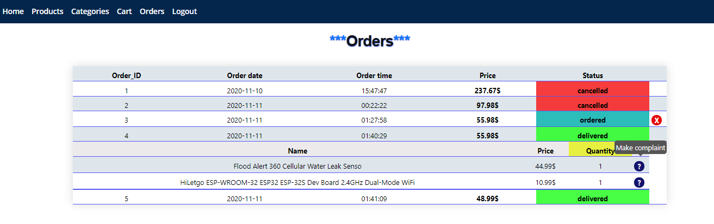
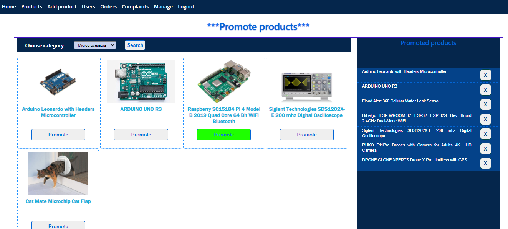
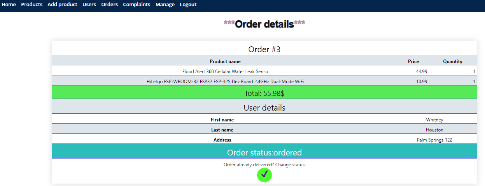

# PHP Online Store

## About
 

## Project scope

### Functionalities:

- Authorization:
  - Administrator
  - Customer

Real estate listings can be created, modified or delete by the real estate agent or agency client. Depending on a type of real estate listing, there are different types of information that have to be provided.
There are three type of listings:

- Real estate listings
  - Sale
  - Rent
  - Daily rent
- Add pictures for real estate listing (agent, client)
- Add description about listing (info about listing, current state, neighborhood data, shops, bars, restaurants, schools, etc. )
- Add description for real estate listing (agent)
- Promote listing (agent, add listing to home page)
- Add listing to Favourites (like) (for customers)
- Search filters ( city, min price, max price, min size(m2), max size(m2) )
- Collecting customers search data (most viewed listings, listings with most likes, customer search trends)
- Ask direct question to agent (select listing, ask question)
- Messaging/Chat service (inbox, outbox, write new message, reply)
- Reservation system (daily rent type of real estates)
- Review/rate previously used real estates (cutomers, daily rent type)
 

## Preview

## User panel

### Search by category:

### Product info:

### List of orders:

## Admin panel

### romoted products:
 

### Shipment details:
  

